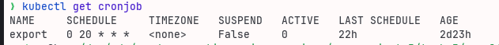
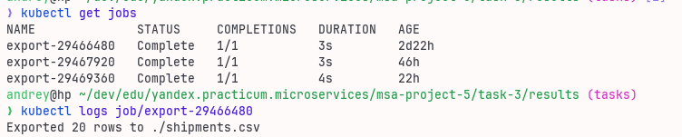

# Пакетная выгрузка данных из PostgreSQL в CSV

## Архитектура
- **PostgreSQL**: StatefulSet с инициализацией тестовой таблицы `shipments`.
- **Экспортёр**: Приложение, подключается к БД и экспортирует данные в CSV.
- **CronJob**: Планирует запуск экспортёра по расписанию.
- **Secrets/ConfigMaps**: Хранение учетных данных и конфигурации.


## Exporter
Скрипт на python который:

- считывает настройки из окружения,
- подключается к БД,
- делает запрос,
- создает CSV файл,
- сохраняет файл в директории из переданных настроек,
- пишет в консоль содержимое файла (для демонстрации).

## Запуск

1. Собрать Docker-образ

   ```bash
   docker build -t exporter .
   ```

2. Запустить Minikube и загрузить в него образ:

   ```bash
   minikube start
   minikube image load exporter
   ```

3. Применить манифесты

   ```bash
   kubectl apply -f k8s
   ```
4. Проверить CronJob

   ```bash
   kubectl get cronjob
   ```

   

5После запуска Job можно посмотреть логи

   ```bash
   kubectl get jobs
   kubectl logs export-<id>
   ```

   
