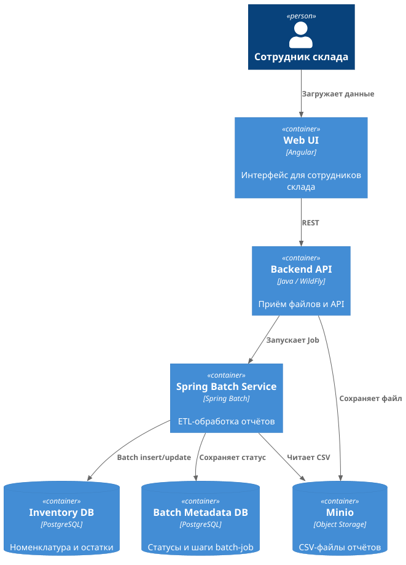

**Название задачи:** Выбор Spring Batch для ETL-обработки данных о товарах и программе лояльности

**Автор:** Инжиниринг-лид

**Дата:** 2026-01-10

### Функциональные требования
Опишите здесь верхнеуровневые Use Cases. Их нужно оформить в виде таблицы с пошаговым описанием.

| **№** | **Действующие лица или системы** | **Use Case**                 | **Описание**                                                                                   |
|:-----:|:---------------------------------|:-----------------------------|:-----------------------------------------------------------------------------------------------|
|   1   | Система ETL                      | Загрузка данных о товарах    | Извлечение данных о товарах из CSV-файла product-data.csv                                      |
|   2   | Система ETL                      | Загрузка данных лояльности   | Извлечение данных о программе лояльности из CSV-файла loyality_data.csv                        |
|   3   | Система ETL                      | Обновление данных лояльности | Трансформация данных товаров с обновлением информации о лояльности на основе справочных данных |
|   4   | Система ETL                      | Сохранение результатов       | Загрузка обновленных данных товаров в таблицу products в PostgreSQL                            |
|   5   | Система ETL                      | Мониторинг процесса          | Отслеживание статуса выполнения ETL-процесса и логирование результатов                         |

### Нефункциональные требования
Опишите здесь нефункциональные требования и архитектурно значимые требования.

| **№** | **Требование**                                      |
|:-----:|:----------------------------------------------------|
|   1   | Обработка больших объемов данных (batch processing) |
|   2   | Транзакционность операций                           |
|   3   | Восстановление после сбоев (restart capability)     |
|   4   | Мониторинг и логирование процесса                   |
|   5   | Масштабируемость решения                            |
|   6   | Простота развертывания и конфигурации               |
|   7   | Интеграция с существующей Spring экосистемой        |
|   8   | Поддержка различных источников данных (CSV, JDBC)   |

### Решение

**Выбранная технология:** Spring Batch

**Обоснование выбора:**

1. **Опыт команды:** Инжиниринг-лид имеет обширный опыт работы со Spring Batch, что снижает риски и ускоряет разработку.

2. **Соответствие требованиям:**
    - **Batch Processing:** Spring Batch специально разработан для пакетной обработки данных
    - **Транзакционность:** Встроенная поддержка транзакций на уровне chunk'ов
    - **Restart Capability:** Автоматическое восстановление после сбоев с возможностью продолжения с точки останова
    - **Мониторинг:** Встроенные механизмы мониторинга и метрик
    - **Масштабируемость:** Поддержка параллельной обработки и распределенных вычислений

3. **Архитектурные преимущества:**
    - **Модульность:** Четкое разделение на Reader, Processor, Writer
    - **Переиспользование:** Возможность создания переиспользуемых компонентов
    - **Тестируемость:** Встроенная поддержка unit и integration тестов
    - **Конфигурируемость:** Декларативная конфигурация через Spring

4. **Интеграция с экосистемой:**
    - **Spring Boot:** Полная интеграция с Spring Boot для упрощения развертывания
    - **Spring Data:** Интеграция с Spring Data для работы с базами данных
    - **Spring Security:** Возможность добавления безопасности при необходимости

**Архитектура решения:**

1. Пользователь загружает отчёт через Web UI
2. Backend сохраняет файл в Google Cloud Storage
3. Backend инициирует Spring Batch Job
4. Spring Batch:
   - читает CSV-файл из GCS;
   - валидирует и обогащает данные;
   - выполняет пакетную загрузку в PostgreSQL;
5. Статус выполнения сохраняется в Batch Metadata DB
6. Web UI не блокируются ETL-процессами

### Альтернативы

**1. Apache Spark**
- **Преимущества:** Высокая производительность, поддержка больших данных
- **Недостатки:** Сложность настройки, избыточность для простых ETL-задач, отсутствие опыта в команде

**2. Apache Airflow**
- **Преимущества:** Мощный оркестратор, хорошая визуализация
- **Недостатки:** Сложность для простых batch-задач, дополнительные зависимости

**3. Apache Kafka Streams**
- **Преимущества:** Real-time обработка
- **Недостатки:** Не подходит для batch-обработки, сложность настройки

**Недостатки, ограничения, риски**

**Недостатки выбранного решения:**
1. **Производительность:** Spring Batch может быть медленнее специализированных решений для очень больших объемов данных
2. **Сложность конфигурации:** Для сложных сценариев конфигурация может стать громоздкой
3. **Память:** Обработка больших chunk'ов может потреблять значительное количество памяти

**Ограничения:**
1. **Real-time обработка:** Spring Batch не подходит для real-time обработки данных
2. **Горизонтальное масштабирование:** Требует дополнительной настройки для распределенной обработки

**Риски:**
1. **Технический долг:** При росте требований может потребоваться миграция на более производительные решения
2. **Обучение:** Новым членам команды потребуется изучение Spring Batch
3. **Мониторинг:** Необходимость настройки дополнительных инструментов мониторинга для production

**Меры по снижению рисков:**
1. Создание подробной документации и примеров использования
2. Настройка comprehensive мониторинга и алертинга
3. Планирование архитектуры с учетом возможной миграции в будущем
4. Регулярный review производительности и оптимизация
